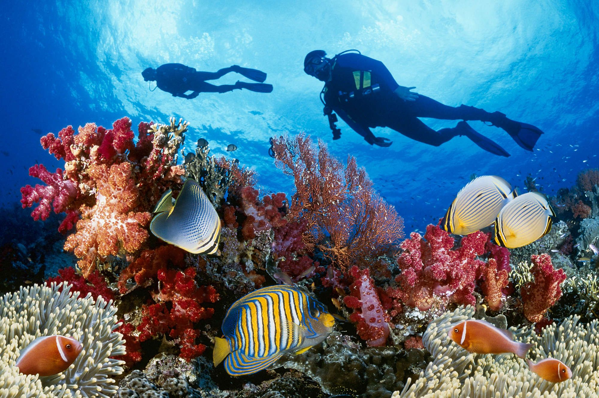
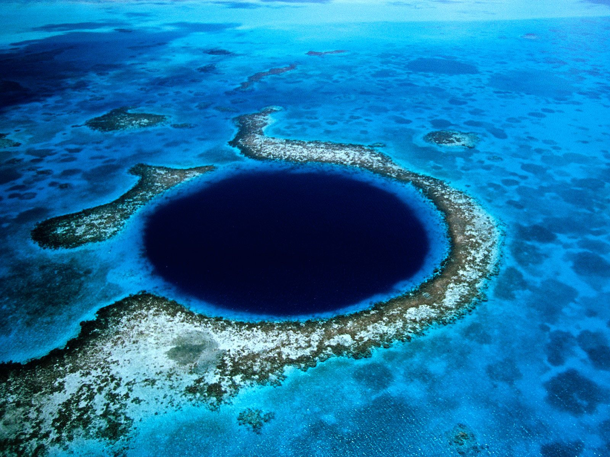
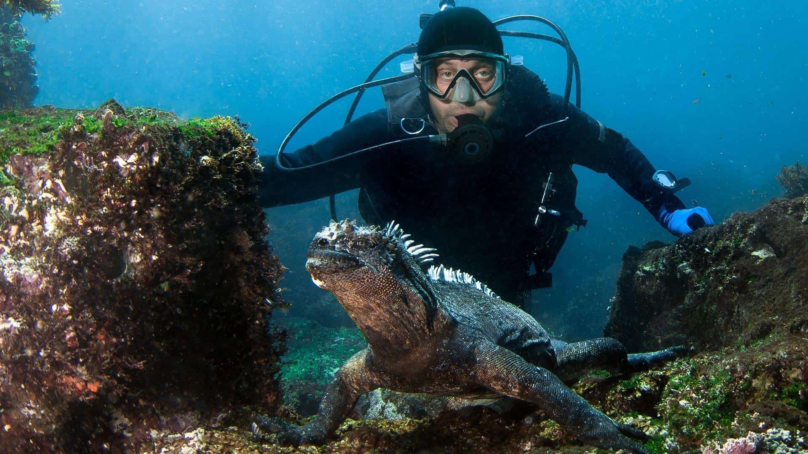
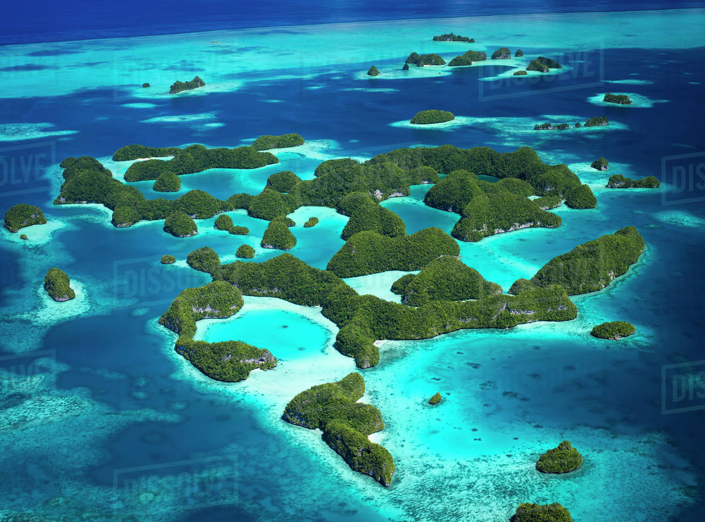

<DOCTYPE html>
<html lang="en">
<head>
  <meta charset="UTF-8">
  <meta name="viewport" content="width=device-width, initial-scale=1.0">
  <title>Scuba Diving Locations</title>
  
</head>
<body>
  <header>
    <h1>Popular Scuba Diving Locations</h1>
    
Explore the underwater world at these famous diving spots!

  </header>

  

    <figure class="image-link">
      
      <figcaption>Great Barrier Reef</figcaption>
      
Discover the vibrant coral reefs and marine life of Australia.

    </figure>
    <figure class="image-link">
      
      <figcaption>Blue Hole, Belize</figcaption>
      
Dive into the mysterious depths of this iconic underwater sinkhole.

    </figure>
    <figure class="image-link">
      
      <figcaption>Galapagos Islands</figcaption>
      
Swim alongside unique species in this UNESCO World Heritage site.

    </figure>
    <figure class="image-link">
      
      <figcaption>Palau, Micronesia</figcaption>
      
Experience breathtaking underwater caves and diverse marine ecosystems.

    </figure>
  

  <footer>
    
&copy; 2025 Scuba Diving Adventures. All rights reserved.

  </footer>
</body>
</html>
